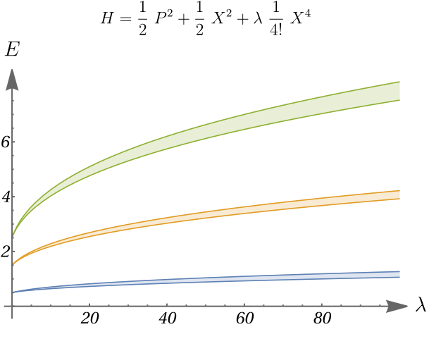

# Exact Numerics



This project aims to answer a simple question: **how close are we to the exact solution of a given problem after performing a finite computation?**

At first sight, answering this question rigorously seems to require access to the exact solution itself. However, for many problems, exact upper and lower bounds can be derived without knowing the exact solution. The key is to combine an approximate solution with suitable global properties of the problem.

These approaches are not applicable to every numerical problem, but they apply to large and relevant classes of problems arising in mathematics, physics, and engineering.

> **Hieron:** But are strict proofs in applied mathematics really necessary? After all, as you said, the mathematical model is only an approximation of reality. If you use approximately correct formulae, your results will be still approximately close to reality and they can never be absolutely correct anyway.
**Archimedes:** You are mistaken, my king. Just because the mathematical model is only an approximation and there is always a certain discrepancy with the facts, one has to take care not to increase this discrepancy further by a careless use of mathematics. One has to be as accurate as possible. By the way, in regard to approximations, there is a common misunderstanding that using approximations means departing from mathematical precision. Approximations have a precise theory, and results about approximations—for instance, inequalities—have to be proved as rigorously as identities. Perhaps you remember the approximations which I gave for the area of a circle with given diameter; I proved them with a rigor usual in geometry.
>
> <p align="right"><em>— Alfréd Rényi, Dialogues on Mathematics</em></p>

The project is a collection of methods for [numerical certification](https://en.wikipedia.org/wiki/Numerical_certification), with special emphasis on **a posteriori certification** (where guarantees are derived not from the details of the approximation method itself, but from a proposed approximation together with global properties of the underlying problem).

## Methods and examples

The current [notes](ExactNumerics.pdf) contain, at varying levels of development:

- **Root certification:** elementary error bounds from global derivative estimates, and Newton-type bounds related to the Newton–Kantorovich theorem.
- **Spectral bounds:** Gershgorin circles, Brauer's ovals of Cassini, and Krylov–Weinstein bounds for locating or excluding eigenvalues.
- **Operator comparison methods:** majorization, minorization, and envelope methods for obtaining rigorous spectral bounds by comparison with simpler operators.
- **Auxiliary-space and effective-operator methods:** enlarged Hilbert-space constructions, square-root operators, Schur complements, and low/high-energy decompositions.
- **Local and variational methods:** local-energy bounds, Hoffman–Wielandt-type estimates, semiclassical matching, and concavity properties of eigenvalues.
- **Semidefinite methods:** positivity constraints on finite matrices of operator expectation values.
- **Matrix elements and form factors:** rigorous bounds for diagonal and off-diagonal matrix elements, including doubled- and tripled-Hilbert-space constructions for absolute values and complex cyclic products.
- **Examples and testing grounds:** simple root-finding problems, the quantum pendulum, quartic and anharmonic oscillators, rectangular and Pöschl–Teller potentials, and sketches involving supersymmetric field theories and the quantum-mechanical bootstrap.

## The broad vision

One source of inspiration for this project is the use of formal proof assistants such as *Lean*, prominently adopted and advocated by [Terence Tao](https://www.ams.org/journals/notices/202501/noti3041/noti3041.html) and others. In such a setting, experimental or AI-assisted methods can propose proofs, while the final result is checked independently by the proof assistant. A convincing-looking but incorrect proof is not accepted simply because it looks plausible: it must satisfy the formal verification procedure.

> formal proof assistants and computer algebra packages could filter out the now-notorious tendency of large language models to “hallucinate” plausible-looking nonsense
>
> <p align="right"><em>— Terence Tao, Machine-Assisted Proof</em></p>

, Machine-Assisted Proof, Notices of the American Mathematical Society 72(1), 2025.


The aim of **Exact Numerics** is to develop an analogous layer of verification for numerical computation.

For numerical problems, exact equality with the true solution is usually neither available nor necessary. What is often required instead is that certain quantities of interest lie within a *predefined tolerance* of their exact values. If this property can itself be rigorously certified, then an approximate numerical solution can play a role similar to a proposed formal proof: it may be generated by essentially any method, but its validity is checked independently.

The central idea is that, if sufficiently strong *global properties* of the numerical problem are known, one can often derive exact upper and lower bounds around a proposed approximate solution without relying on the details of the method that produced it.

In this sense, a well-posed numerical problem together with specified tolerances can be regarded as solved once a proposed solution has been accompanied by a rigorous certificate showing that the relevant exact quantities lie inside those tolerances.

This opens the possibility of a numerical analogue of formally verified AI-assisted mathematics. Experimental AI/ML methods, heuristic algorithms, perturbative techniques, black-box optimizers, or other sophisticated numerical solvers could be used freely to generate candidate solutions. Potentially convincing but erroneous results would then be rejected by an independent certification stage, while sufficiently accurate candidates would receive rigorous error bounds.

The present project focuses primarily on this *verification and certification layer*. In a larger computational pipeline, we imagine these methods operating at the end of a potentially sophisticated chain of numerical solvers and solution-generating methods:

**Numerical problem → quantities of interest and tolerances → candidate solution → rigorous certification → certified result**

The method used to generate the candidate may be approximate, heuristic, learned, or experimental; the final guarantee should not be.


## Call for collaboration

This is a **working note**, and the project is actively open to contributions and collaboration.

We are interested in people who would like to join the project by contributing:

- new ideas or rigorous bounding methods,
- examples from different areas of mathematics, physics, engineering, or numerical analysis,
- implementations and tests of the methods in computational software such as **Python**, **Mathematica**, or any other reproducible programming language or computational environment,
- comparisons between different certification techniques,
- numerical experiments illustrating the practical strengths and limitations of the methods.

We would also be very grateful for references to relevant papers, existing numerical-certification techniques, or exact-bound methods from other fields that may fit into the broader framework of this project.

If you are interested in contributing, testing ideas, suggesting references, or developing part of the project further, **please get in touch**. We are very open to collaboration.


## Citation

If you find this work useful, please consider citing:

```bibtex
@misc{ExactNumerics,
  author = {Jozsef Konczer and Rithwik Ranganathan},
  title  = {Methods for Exact Numerics: A Collection of Controlled Approximations},
  year   = {2026},
  url    = {https://github.com/Konczer/ExactNumerics}
}
```
